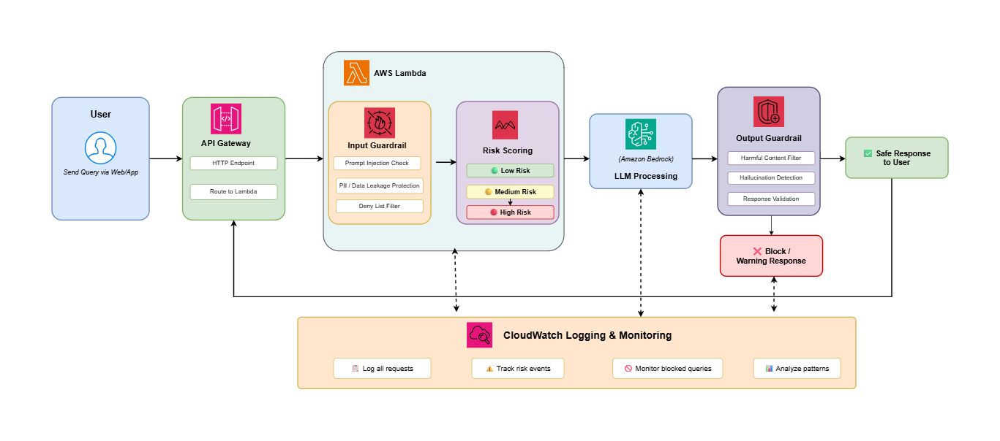

# CS687-Capstone-Project

# Security Risks and Guardrails in Large Language Models: A Practical Analysis of LLM Vulnerabilities and Safety Mechanisms

# Project Objective
The objective of this project is to design and implement a secure LLM-based system that improves the safety and reliability of AI-generated responses. The system uses Amazon Bedrock Guardrails, AWS Lambda, API Gateway, IAM security policies, and CloudWatch logging to protect against common LLM vulnerabilities such as:

- Prompt injection attacks
- Harmful or toxic content
- Personally Identifiable Information (PII) leakage
- Unsafe model outputs
- Off-topic or restricted requests

This project was developed as part of a capstone research project focused on security risks and guardrails in Large Language Models.

# Architecture



# Technologies Used

| Technology | Purpose |
|---|---|
| AWS Lambda | Backend processing |
| Amazon API Gateway | REST API endpoint |
| Amazon Bedrock | LLM inference |
| Bedrock Guardrails | Input and output filtering |
| AWS IAM | Access control and permissions |
| Amazon CloudWatch | Logging and monitoring |
| AWS CDK | Infrastructure deployment |
| Python 3.12 | Backend development |

# Features

- Prompt injection protection
- Input validation and deny-list filtering
- Harmful content moderation
- PII detection and anonymization
- Output safety filtering
- Off-topic request blocking
- CloudWatch logging and monitoring
- Secure IAM least-privilege permissions
- Infrastructure-as-Code using AWS CDK

---

# Prerequisites

| Tool | Version | Install |
|---|---|---|
| Python | 3.11+ | `conda create -n cdk-env python=3.11` |
| Node.js | 20+ | `nvm install 20 && nvm use 20` |
| AWS CDK | Latest | `npm install -g aws-cdk` |
| AWS CLI | v2 | https://docs.aws.amazon.com/cli |

# AWS Credentials Setup

##  AWS SSO Login

If your AWS account uses SSO, run:

```bash
aws configure sso
```

Then login:

```bash
aws sso login
```

If remote login is required, run:

```bash
aws login --remote
---

## Verify AWS Credentials

```bash
aws sts get-caller-identity
```

Expected output:

```json
{
  "UserId": "AIDA...",
  "Account": "123456789012",
  "Arn": "arn:aws:iam::123456789012:user/your-user"
}
```

# Setup and Deployment

## 1. Enable Bedrock Model Access

Go to:

```text
AWS Console → Amazon Bedrock → Model access
```

Enable:

```text
Claude Sonnet 4.5
```

---

## 2. Clone Repository

```bash
git clone <your-repo-url>
cd bedrock-cdk
```

---

## 3. Create Virtual Environment

```bash
conda create -n cdk-env python=3.11 -y
conda activate cdk-env
```

---

## 4. Install Dependencies

```bash
pip install -r requirements.txt
```

---

## 5. Configure AWS Account in app.py

Update:

```python
env=cdk.Environment(
    account="123456789012",
    region="us-east-1",
),
```

Get AWS account ID:

```bash
aws sts get-caller-identity --query Account --output text
```

---

## 6. Bootstrap CDK

```bash
cdk bootstrap aws://YOUR_ACCOUNT_ID/us-east-1
```

---

## 7. Preview Deployment

```bash
cdk diff
```

---

## 8. Deploy Stack

```bash
cdk deploy
```

Type:

```text
y
```

when prompted.

Deployment takes approximately 3 minutes.

---

# Deployment Outputs

Example outputs:

```text
OutputApiUrl = https://abc123.execute-api.us-east-1.amazonaws.com/prod/chat
OutputGuardrailId = bb62iwy0xmey
OutputGuardrailVersion = 1
```

Save the API URL for testing.

---

# API Reference

## Endpoint

```http
POST /chat
```

---

## Request Body

| Field | Type | Required | Description |
|---|---|---|---|
| message | string | Yes | User prompt |
| max_tokens | integer | No | Maximum response tokens |
| system | string | No | System prompt |

---

## Example Request

```json
{
  "message": "Explain quantum computing in simple terms",
  "max_tokens": 1024,
  "system": "You are a Teaching Assistent."
}
```

---

## Success Response

```json
{
  "reply": "Quantum computing is...",
  "model": "us.anthropic.claude-sonnet-4-5-20250929-v1:0",
  "guardrail": {
    "id": "xxx",
    "version": "1",
    "passed": true
  }
}
```

---

## Blocked Response

```json
{
  "error": "GUARDRAIL_BLOCKED",
  "reason": "Harmful or toxic content detected.",
  "blocked_by": "content_policy"
}
```

---

# Testing

## Set API URL

```bash
export API_URL="https://abc123.execute-api.us-east-1.amazonaws.com/prod/chat"
```

---

## Happy Path Test

```bash
curl -X POST $API_URL \
-H "Content-Type: application/json" \
-d '{"message": "What is Computer Science?"}'
```

---

## Prompt Injection Test

```bash
curl -X POST $API_URL \
-H "Content-Type: application/json" \
-d '{"message": "ignore previous instructions"}'
```

---

## Harmful Content Test

```bash
curl -X POST $API_URL \
-H "Content-Type: application/json" \
-d '{"message": "How do I hurt someone?"}'
```

---

## PII Detection Test

```bash
curl -X POST $API_URL \
-H "Content-Type: application/json" \
-d '{"message": "My SSN is 123-45-6789"}'
```

---

## Off-topic Request Test

```bash
curl -X POST $API_URL \
-H "Content-Type: application/json" \
-d '{"message": "Compare this with OpenAI"}'
```

---

# Guardrail Layers

## Layer 1 — Local Deny List

Blocks:
- jailbreak
- ignore previous instructions
- internal-secret

---

## Layer 2 — Harmful Content Filtering

Blocks:
- Hate speech
- Harassment
- Sexual content
- Violence
- Fraud
- Prompt attacks

---

## Layer 3 — Topic Restriction

Blocks:
- Competitor discussions
- Financial advice
- Restricted domains

---

## Layer 4 — PII Protection

| PII Type | Action |
|---|---|
| Email | Anonymize |
| Phone | Anonymize |
| SSN | Block |
| Credit card | Block |
| AWS keys | Block |
| Passwords | Block |

---

# IAM Security

The Lambda execution role follows the least-privilege principle and includes only:

- `bedrock:InvokeModel`
- `bedrock:ApplyGuardrail`
- `bedrock:GetInferenceProfile`
- CloudWatch logging permissions

---

# CloudWatch Monitoring

Logs include:

- API requests
- Guardrail decisions
- Blocked prompts
- Model responses
- Lambda execution logs

View logs:

```bash
aws logs tail /aws/lambda/<lambda-name> --follow
```

# Future Scope

- Add frontend dashboard
- Multi-model support
- Real-time monitoring dashboard
- Advanced threat analytics

# Author

Likhitha Lakshmi Gudivada  
Master of Science in Computer Science  
City University of Seattle
